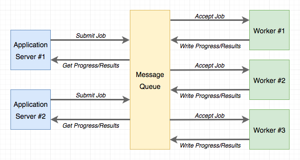

# Python Async tasks with Python RQ and Flask

### Resources
- Redis container
    ```
        docker run \
        -p 6379:6379 \  
        -v /home/jon/docker-data:/data \
        -d redislabs/redismod \
        -- loadmodule /usr/lib/redis/modules/redistimeseries.so \
        -- dir /data \
        -- dbfilename dump.rdb
    ```

- GUI Client: Redis Commander
    - `npm install -g redis-commander`
---
Notes from [Chapter 22](https://blog.miguelgrinberg.com/post/the-flask-mega-tutorial-part-xxii-background-jobs) of Miguel Gringberg's excellent Flask series



1. Intro
    - RQ is more straighfoward than Celery for basic background task functionality
2. Using RQ
    - `pip install rq`
3. Creating a task
    - Basic background task
        ```
            import time

            def example(seconds):
                print('Starting task')
                for i in range(seconds):
                    print(i)
                    time.sleep(1)
                print('Task completed')
        ```
4. Run the RQ worker
    - `(venv) $ rq worker microblog-tasks`
    - Worker process now connected to redis
5. Executing Tasks
    - Open a second terminal window, and Python IDLE
        ```
        >>> from redis import Redis
        >>> import rq
        >>> queue = rq.Queue('microblog-tasks', connection=Redis.from_url('redis://'))
        >>> job = queue.enqueue('app.tasks.example', 23)
        >>> job.get_id()
        'c651de7f-21a8-4068-afd5-8b982a6f6d32'
        ```
6. Reporting Task Progress
    - Add to `meta` attribute, any information to be exposed to the app about the job

7. Database representation of tasks
    - When a task is started as part of a request, the context will be lost
    - To keep track of what tasks each user is running. need to use a db to keep track of state
    - In Flask, when model is added, run `flask db migrate -m "tasks"`

8. Integrate RQ with the Flask application
    - Add config for the Redis services in `Config()` object

    - Application factory function in `app/__init__.py` initialises Redis and RQ
        ```
        app.task_queue = rq.Queue('microblog-tasks', connection=app.redis)
        ```
    - `User.launch_task()   # takes care of submitting the task to RQ and DB`

9. Sending Emails from the RQ task
    - The app's `send_mail()` function already sends mails asynychronously using a background thread

10. Task Helpers
    - In order to use other functions from the flask app, `tasks.py` must have a flask aplication instance and context
        - App is created in `tasks.py` because this is the only module the RQ worker will import
        - RQ worker needs to be aware of flask
    - Create a wrapper function dedicated to updating progress (similar to notifications in [Chapter 21](https://blog.miguelgrinberg.com/post/the-flask-mega-tutorial-part-xxi-user-notifications))

11. Implementing the Export task
    - High level structure
        ```
        def export_posts(user_id):
            try:
                # read user posts from database
                # send email with data to user
            except:
                # handle unexpected errors

                _set_task_progress(100)
                app.logger.error('Unhandled exception', exc_info=sys.exc_info())
        ```
    - Need a `try/except` block because unexpected errors will only display error to console and the RQ will wait for new jobs
        - Can output to a [log set in Chatpter 7](https://blog.miguelgrinberg.com/post/the-flask-mega-tutorial-part-vii-error-handling)

12. Export functionality in the Application
    - Plumb in the routes

13. Progress Notifications
    - Method to render task alerts, same as flashed messages (not Ajax)
    - Periodically asking the server for updates (see notification handler)

14. Deployment Considerations
    - On Linux
        - To run RQ worker process, follow [Chapter 17](https://blog.miguelgrinberg.com/post/the-flask-mega-tutorial-part-xvii-deployment-on-linux) and run
            - `rq worker microblog-tasks` instead of `gunicorn`
            - Running more than one: use Supervisor's `numprocs` directive
    - On Docker
        - Create redis containers
            - ```$ docker run --name redis -d -p 6379:6379 redis:3-alpine```
        - When running app, link the redis container and set `REDIS_URL` env var
        - Run one or more RQ worker container


---
## Building Progress Bars with Django and Celery
    - https://buildwithdjango.com/blog/post/celery-progress-bars/