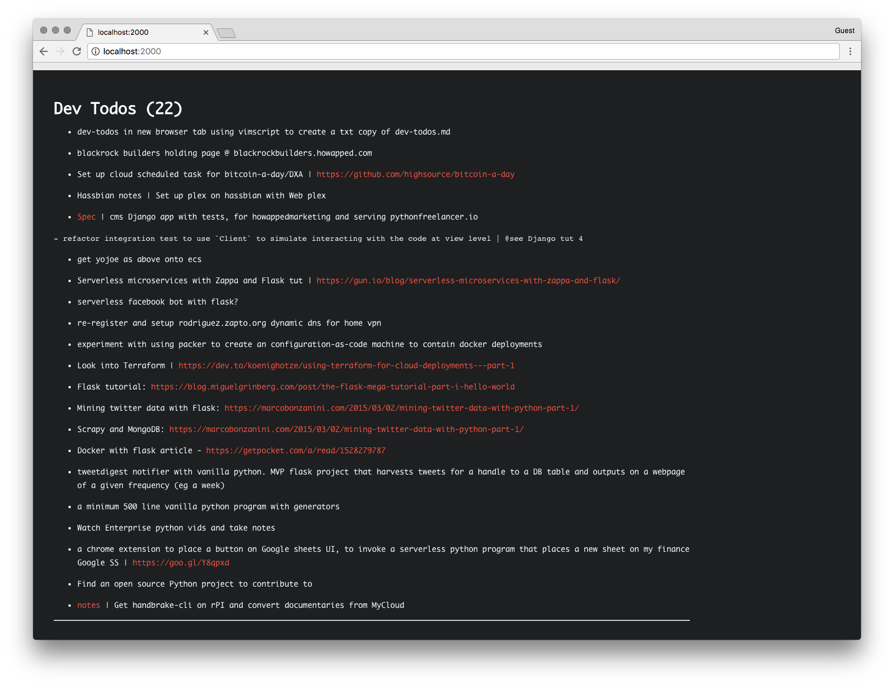

# Knowledge

Collecting thoughts in [index.md](index.md) with vimwiki

## Dev-todos on Chrome Start Page

To give the Toodos a bit more visibility, out of Vim, the dev-todos page can be set as a Chrome Start page

Steps to do this in macos

1. Clone this repo
2. Ensure there is a dev-todos.md file
    mv dev-todos.md.example dev-todos.md
3. Move the launchd script to the Mac's daemon directory
    mv browsertab-wiki/init/macos/Library/LaunchAgents/com.browsertabwikiserver.plist /Users/jon/Library/LaunchAgents
4. Load the daemon
    launchctl load ~/Library/LaunchAgents/com.browsertabwikiserver.plist
5. You should see the page rendered by pointing your browser at http://localhost:2000
6. Install Replace New Tab Page Chrome extension
    https://chrome.google.com/webstore/detail/replace-new-tab-page/cnkhddihkmmiiclaipbaaelfojkmlkja
